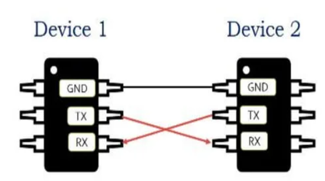
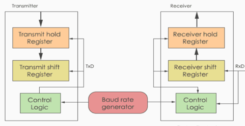
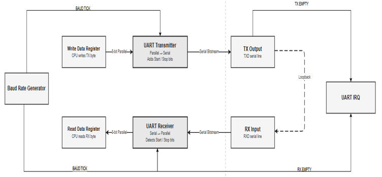
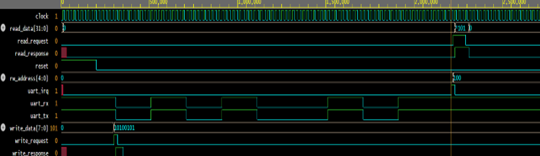

# UART Protocol Implementation Using Verilog

## Overview

This project presents the design and simulation of a Universal Asynchronous Receiver Transmitter (UART) using Verilog HDL. The design includes both UART Transmitter and UART Receiver modules along with a Baud Rate Generator, Memory-Mapped Register Interface, and Interrupt Generation logic.

The UART module enables reliable asynchronous serial communication without requiring a shared clock signal between communicating devices. Functional verification was performed using a loopback configuration, where the transmitter output was connected directly to the receiver input, validating successful end-to-end data transmission and reception.

## Features

- UART Transmitter and Receiver
- Baud Rate Generator
- Memory-Mapped Register Interface
- UART Interrupt Generation
- Loopback Verification
- Start and Stop Bit Detection
- Serial-to-Parallel Conversion
- Parallel-to-Serial Conversion
- 8-Bit Data Communication
- Verilog Testbench Verification

## UART Protocol Overview

UART (Universal Asynchronous Receiver Transmitter) is an asynchronous serial communication protocol that allows data exchange between digital systems without a shared clock signal.

Communication is performed using two signals:

- TX (Transmit)
- RX (Receive)

Both devices operate at the same baud rate to ensure reliable communication. 

## UART Communication System

## UART Architecture

The UART architecture consists of:

- UART Transmitter
- UART Receiver
- Baud Rate Generator
- Control Logic
- Transmit Holding Register
- Receive Holding Register

The baud rate generator provides timing signals for both transmission and reception. 

## System Architecture

The proposed system includes:

- Baud Rate Generator
- UART Transmitter
- UART Receiver
- Write Data Register
- Read Data Register
- TX Output Interface
- RX Input Interface
- UART Interrupt Module

## UART Frame Format

The implemented UART frame consists of:

| Field | Size |
|---------|---------|
| Start Bit | 1 Bit |
| Data Bits | 8 Bits |
| Stop Bit | 1 Bit |

**Total Frame Length = 10 Bits** 

## Baud Rate Generation

The design uses an internal counter-based baud rate generator that divides the system clock to produce baud ticks required for UART transmission and reception.

Common UART baud rates include:

- 9600 bps
- 19200 bps
- 38400 bps
- 57600 bps
- 115200 bps 

## UART Transmitter Design

### Features

- Start Bit Generation
- Stop Bit Generation
- Parallel-to-Serial Conversion
- 8-Bit Data Transmission
- Baud Rate Controlled Transmission
- Transmission Status Monitoring

### Working

The transmitter loads parallel data into a transmit register and constructs a UART frame containing:

- Start Bit
- 8 Data Bits
- Stop Bit

The frame is then shifted serially through the TX line. 

## UART Receiver Design

### Features

- Start Bit Detection
- Serial-to-Parallel Conversion
- Half-Bit Synchronization
- Stop Bit Verification
- Receive Data Storage
- Interrupt Generation

### Working

The receiver continuously monitors the RX line. Upon detecting a valid Start Bit, it samples incoming serial data according to the baud rate and reconstructs the original data byte. After successful reception, an interrupt is generated. 

## Register Map

| Register | Address | Access |
|------------|------------|------------|
| REG_WDATA | 0x00 | Write |
| REG_RDATA | 0x04 | Read |
| REG_READY | 0x08 | Read |
| REG_RXSTATUS | 0x0C | Read |

These registers provide processor access to transmit data, receive data, status information, and interrupt handling. 

## Interrupt Generation

The UART module generates an interrupt whenever valid data is successfully received.

Benefits:

- Eliminates continuous polling
- Improves communication efficiency
- Enables timely processing of received data

The interrupt is cleared after processor acknowledgement or register access. 

## Testbench Design

### Features

- Automatic 50 MHz Clock Generation
- Reset Generation
- UART Transmission Verification
- UART Reception Verification
- CPU Read/Write Tasks
- Loopback Communication Testing

### Test Cases

| Test No | Data |
|----------|----------|
| 1 | 0xA5 |
| 2 | 0x3C |
| 3 | 0xFF |
| 4 | 0x00 |

## Simulation Results

Simulation verifies:

- UART Frame Generation
- Data Transmission
- Data Reception
- Interrupt Generation
- Register Operations
- Loopback Communication

## Project Report

A detailed report containing UART architecture, register design, transmitter and receiver implementation, testbench design, and simulation results is available in the report folder.

## Author

Dharmi Patel

